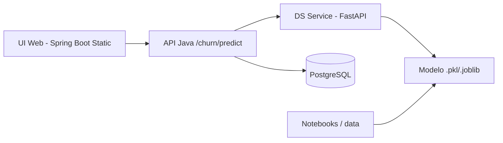

<p align="center">
  
</p>

<h1 align="center">ChurnInsight - Previsao de Churn (Hackathon NoCountry)</h1>

<p align="center">
  MVP de previsao de churn com Data Science em Python + API REST em Java (Spring Boot)
</p>

<p align="center">
  <a href="#sumario">Sumario</a> |
  <a href="#como-executar-local">Como executar</a> |
  <a href="#docker-compose-ui-completa">Docker Compose</a> |
  <a href="#endpoints-principais">Endpoints</a>
</p>

<p align="center">
  <a href="https://www.oracle.com/java/">
    
  </a>
  <a href="https://spring.io/projects/spring-boot">
    
  </a>
  <a href="https://www.python.org/">
    
  </a>
  <a href="https://fastapi.tiangolo.com/">
    
  </a>
  <a href="https://www.docker.com/">
    
  </a>
</p>

<p align="center">
  
</p>

Repositorio **churninsight-nocountry** - MVP de previsao de churn (cancelamento de clientes) desenvolvido para o **hackathon da plataforma NoCountry**, focado em negocios de **servicos e assinaturas** (Telecom, Fintech, Streaming, E-commerce).

A solucao combina:

- **Data Science em Python** para treinar um modelo de classificacao binaria (vai cancelar / vai continuar);
- **API REST em Java (Spring Boot)** para expor o modelo e permitir o consumo por outros sistemas;
- **UI Web** servida pela API para demonstracao funcional do fluxo de previsao.

---

## Sumario

1. [Resumo rapido](#resumo-rapido)
2. [Descricao do desafio (Hackathon NoCountry)](#descricao-do-desafio-hackathon-nocountry)
   - [Setor de negocio](#setor-de-negocio)
   - [Descricao do projeto](#descricao-do-projeto)
   - [Necessidade do cliente (explicacao nao tecnica)](#necessidade-do-cliente-explicacao-nao-tecnica)
   - [Validacao de mercado](#validacao-de-mercado)
   - [Expectativa para este hackathon](#expectativa-para-este-hackathon)
   - [Entregaveis desejados](#entregaveis-desejados)
   - [Funcionalidades exigidas (MVP)](#funcionalidades-exigidas-mvp)
   - [Funcionalidades opcionais](#funcionalidades-opcionais)
   - [Orientacoes tecnicas para alunos](#orientacoes-tecnicas-para-alunos)
   - [Contrato de integracao (JSON)](#contrato-de-integracao-json)
3. [Visao geral da solucao](#visao-geral-da-solucao)
4. [Arquitetura](#arquitetura)
5. [Estrutura do repositorio](#estrutura-do-repositorio)
6. [Tecnologias](#tecnologias)
7. [Como executar (local)](#como-executar-local)
   - [Data Science (Python)](#data-science-python)
   - [Microservico Python (opcional)](#microservico-python-opcional)
   - [API Java (Spring Boot)](#api-java-spring-boot)
   - [UI (Web)](#ui-web)
8. [Docker Compose (UI completa)](#docker-compose-ui-completa)
9. [Endpoints principais](#endpoints-principais)
10. [Dataset e modelo](#dataset-e-modelo)
11. [Testes](#testes)
12. [Troubleshooting](#troubleshooting)
13. [Time](#time)

---

## Resumo rapido

| Camada | O que entrega |
| --- | --- |
| Data Science (Python) | EDA, features, treino e serializacao do modelo |
| Microservico (FastAPI) | Endpoint `/predict` com modelo carregado |
| API Java (Spring Boot) | Validacao, integracao DS e UI web |
| UI Web | Formulario, presets e visualizacao de status |
| Banco (opcional) | Persistencia via PostgreSQL |

[Voltar ao Sumario](#sumario)

---

## Descricao do desafio (Hackathon NoCountry)

### Setor de negocio
Servicos e assinaturas (Telecom, Fintech, Streaming, E-commerce) - empresas que dependem de clientes recorrentes e desejam reduzir cancelamentos.

### Descricao do projeto
O desafio do **ChurnInsight** consiste em criar uma solucao que preveja se um cliente esta propenso a cancelar um servico (churn). O objetivo e que o time de Data Science desenvolva um modelo preditivo e que o time de Back-end construa uma API para disponibilizar essa previsao a outros sistemas, permitindo que o negocio aja antes que o cliente decida sair.

### Necessidade do cliente (explicacao nao tecnica)
Toda empresa que vende por assinatura ou contrato recorrente sofre com cancelamentos. Manter clientes fieis e mais barato do que conquistar novos. A empresa quer prever antecipadamente quem esta prestes a cancelar, para poder agir e reter essas pessoas.

### Validacao de mercado
Predicao de churn e uma aplicacao comum e valiosa da ciencia de dados. Empresas de telecom, bancos digitais, academias, streaming e SaaS usam modelos de churn para reduzir perdas financeiras, entender comportamento e aumentar o lifetime value.

### Expectativa para este hackathon
Publico: alunos iniciantes em tecnologia com base em Back-end (Java) e Data Science (Python).  
Objetivo: construir, em grupo, um MVP capaz de prever churn e disponibilizar essa previsao via API funcional.

### Entregaveis desejados
- Notebook (EDA, features, treino, metricas e serializacao do modelo).
- API REST em Java com endpoint de previsao.
- Documentacao minima (README com passos de execucao e exemplos).
- Demonstracao funcional.

### Funcionalidades exigidas (MVP)
- Endpoint `POST /predict` com previsao e probabilidade.
- Carregamento de modelo preditivo.
- Validacao de entrada.
- Resposta estruturada (previsao + probabilidade).
- Exemplos de uso.

### Funcionalidades opcionais
Stats, persistencia, dashboard simples, explicabilidade basica, batch prediction, containerizacao e testes automatizados.

### Orientacoes tecnicas para alunos
Controlar o volume de dados e o uso de recursos (ex.: free tier de cloud).  
Data Science: dataset limpo, modelo simples, features intuitivas, salvar pipeline com `joblib`.  
Back-end: API REST, validacao de entrada, integracao com modelo (microservico Python ou ONNX).

### Contrato de integracao (JSON)
Entrada:
```json
{
  "tempo_contrato_meses": 12,
  "atrasos_pagamento": 2,
  "uso_mensal": 14.5,
  "plano": "Premium"
}
```

Saida:
```json
{
  "previsao": "Vai cancelar",
  "probabilidade": 0.81
}
```

[Voltar ao Sumario](#sumario)

---

## Visao geral da solucao

A solucao e composta por:

- **Data Science**: notebooks em `notebooks/`, dataset em `data/`, modelo serializado em `model/`.
- **Microservico Python (FastAPI)**: em `ds_service/`, responsavel por carregar o modelo e servir `/predict`.
- **API Java (Spring Boot)**: em `back-end/churn/`, expoe endpoints e serve a UI.
- **Banco de dados**: PostgreSQL via Docker (opcional para persistencia).
- **UI Web**: pagina estatica servida pelo back-end Java em `http://localhost:8080/`.

[Voltar ao Sumario](#sumario)

---

## Arquitetura



Fluxo: a UI chama a API Java, que valida dados e delega a previsao ao microservico Python. O resultado retorna para a UI. A persistencia em banco e opcional.

[Voltar ao Sumario](#sumario)

---

## Estrutura do repositorio

```text
.
|-- back-end/
|   `-- churn/                 # API Java (Spring Boot)
|-- backend/                   # Pasta legado (se aplicavel)
|-- data/
|   `-- raw/                   # Dados brutos
|-- ds_service/                # Microservico Python (FastAPI)
|-- model/                     # Modelos serializados (.joblib/.pkl)
|-- notebooks/                 # EDA e modelagem
|-- docker-compose.yml
`-- README.md                  # Este arquivo
```

[Voltar ao Sumario](#sumario)

---

## Tecnologias

- **Java 21**, **Spring Boot**
- **Python 3.11**, **FastAPI**, **scikit-learn**, **xgboost**
- **PostgreSQL** (opcional)
- **Docker / Docker Compose**

[Voltar ao Sumario](#sumario)

---

## Como executar (local)

### Data Science (Python)
Opcional: treinar ou atualizar o modelo.

```powershell
cd C:\Users\USER\Documents\Repositorios\churninsight-nocountry
python -m venv .venv
.\.venv\Scripts\Activate.ps1
pip install -r ds_service\requirements.txt
```

### Microservico Python (opcional)
Garanta o modelo no caminho esperado:

```powershell
cd C:\Users\USER\Documents\Repositorios\churninsight-nocountry
mkdir ds_service\models -Force
Copy-Item .\model\churn_xgboost_pipeline_tuned.joblib .\ds_service\models\modelo_churn_final.pkl -Force
```

Inicie o FastAPI:
```powershell
cd ds_service
$env:MODEL_PATH="C:\Users\USER\Documents\Repositorios\churninsight-nocountry\ds_service\models\modelo_churn_final.pkl"
uvicorn main:app --reload --host 127.0.0.1 --port 8001
```

### API Java (Spring Boot)
Defina variaveis de ambiente e rode o back-end:

```powershell
cd C:\Users\USER\Documents\Repositorios\churninsight-nocountry\back-end\churn
$env:DS_SERVICE_URL="http://127.0.0.1:8001"
.\mvnw.cmd spring-boot:run
```

### UI (Web)
Abra no navegador:
```
http://localhost:8080/
```

[Voltar ao Sumario](#sumario)

---

## Docker Compose (UI completa)

Este modo sobe **PostgreSQL + Java API + DS Service**.

```powershell
cd C:\Users\USER\Documents\Repositorios\churninsight-nocountry
docker compose up -d --build
```

UI:
```
http://localhost:8080/
```

Checks rapidos:
```
http://localhost:8080/churn/health
http://localhost:8080/churn/ds-health
```

Logs:
```powershell
docker compose logs -f java-api ds-service
```

[Voltar ao Sumario](#sumario)

---

## Endpoints principais

API Java:
- `GET /churn/health`
- `GET /churn/ds-health`
- `POST /churn/predict`

Exemplo de request:
```json
{
  "gender": "Masculino",
  "seniorCitizen": 0,
  "partner": "Sim",
  "dependents": "Sim",
  "tenure": 60
}
```

[Voltar ao Sumario](#sumario)

---

## Dataset e modelo

- Dataset: localizado em `data/` (raw/processed).
- Modelos treinados salvos em `model/`.
- Pipeline utiliza transformacoes de features e classificador supervisionado.

Se o arquivo do modelo estiver com ~134 bytes, ele e um ponteiro LFS. Use um arquivo real (~500 KB).

[Voltar ao Sumario](#sumario)

---

## Testes

Execute os testes automatizados do back-end (unitarios e integracao) usando o Maven Wrapper do projeto. Rode a partir da raiz do repositorio: `C:\Users\USER\Documents\Repositorios\churninsight-nocountry`.

```powershell
cd back-end\churn
.\mvnw.cmd test
```

[Voltar ao Sumario](#sumario)

---

## Troubleshooting

- **503 no /predict**: DS Service sem modelo carregado ou `xgboost` ausente.
- **404 na UI**: back-end nao serviu a pagina estatica (ver logs).
- **Falha no modelo**: verificar tamanho do `.pkl` e logs do DS Service.

[Voltar ao Sumario](#sumario)

---

## Time

Contribuidores do hackathon (NoCountry). Veja o historico de commits no GitHub.

- [brodyandre](https://github.com/brodyandre)

[Voltar ao Sumario](#sumario)
