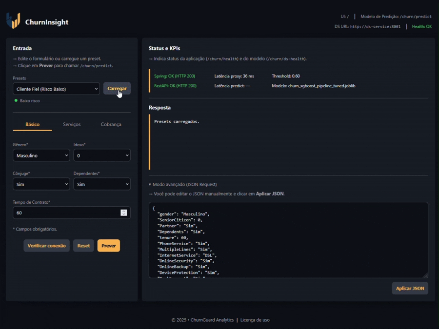
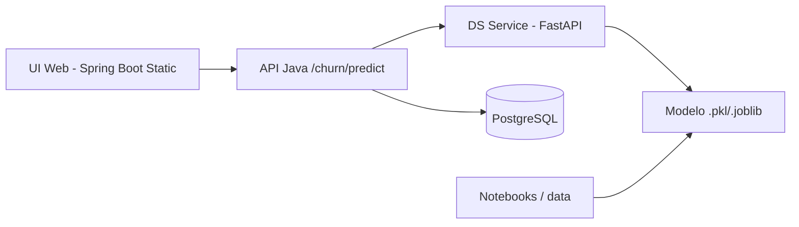

<p align="center">
  
</p>

<h1 align="center">ChurnInsight - Hackathon ONE BR</h1>

<p align="center">
  <strong>Inteligência de Dados para Retenção:</strong> MVP de predição de cancelamento (<i>churn</i>) integrando Data Science e API REST
</p>

<div align="center">

  [](https://www.oracle.com/java/)
  [](https://spring.io/projects/spring-boot)
  [](https://www.python.org/)
  [](https://fastapi.tiangolo.com/)
  [](https://www.docker.com/)

</div>

<p align="center">
  
</p>

O **ChurnInsight** é um MVP de previsão de *churn* (cancelamento de clientes) desenvolvido para o **Hackathon ONE BR**, focado em negócios de **serviços e assinaturas** (Telecom, Fintech, Streaming, E-commerce). 

O objetivo central é fornecer uma ferramenta preditiva que permita às empresas identificar clientes em risco de evasão, possibilitando estratégias de retenção baseadas em dados. A solução combina:

- **Data Science em Python**: Utilizado para a análise exploratória, engenharia de atributos e treinamento de um modelo de classificação binária (proclividade ao cancelamento).
- **API REST em Java (Spring Boot)**: Responsável por expor o modelo de forma segura, validar entradas e permitir o consumo da inteligência por outros sistemas corporativos.
- **UI Web**: Uma interface simplificada servida pela própria API para demonstração funcional do fluxo de previsão em tempo real.

<br>

> [!IMPORTANT]
> **Documentações Complementares:**
> - Estratégia de Data Science: [README_DATA_SCIENCE.md](README_DATA_SCIENCE.md)
> - Detalhes do Back-End: [README_BACK-END.md](back-end/README.md)

---

<a id="sumario"></a>
## 📑 Sumário

1. [Resumo Rápido](#resumo-rapido)
2. [Descrição do Desafio (Hackathon ONE BR)](#descricao-do-desafio)
   - [Setor de Negócio](#setor-de-negocio)
   - [O Projeto: ChurnInsight](#descricao-do-projeto)
   - [Necessidade do Cliente (Visão de Negócio)](#necessidade-do-cliente)
   - [Validação de Mercado](#validacao-de-mercado)
   - [Expectativa para este Hackathon](#expectativa-para-este-hackathon)
   - [Entregáveis Desejados](#entregaveis-desejados)
   - [Funcionalidades Exigidas (MVP)](#funcionalidades-exigidas-mvp)
   - [Funcionalidades Opcionais](#funcionalidades-opcionais)
   - [Orientações Técnicas para Alunos](#orientacoes-tecnicas-para-alunos)
   - [Contrato de Integração (JSON)](#contrato-de-integracao-json)
3. [Visão Geral da Solução](#visao-geral-da-solucao)
4. [Arquitetura](#arquitetura)
5. [Estrutura do Repositório](#estrutura-do-repositorio)
6. [Tecnologias](#tecnologias)
7. [Como Executar Localmente](#como-executar-local)
   - [Microsserviço Python (Motor de Predição)](#data-science-python)
   - [API Java (Spring Boot)](#api-java-spring-boot)
   - [Acesso à Aplicação](#ui-web)
8. [Docker Compose](#docker-compose)
9. [_Endpoints_ Principais](#endpoints-principais)
10. [_Dataset_ e Modelo](#dataset-e-modelo)
11. [Testes](#testes)
12. [_Troubleshooting_ (Resolução de Problemas)](#troubleshooting)
13. [Equipe](#equipe)

---

<a id="resumo-rapido"></a>
## ⚡ Resumo Rápido

| Camada | O que entrega |
| --- | --- |
| Data Science (Python) | EDA, _features_, treino e serialização do modelo |
| Microserviço (FastAPI) | Endpoint `/predict` com modelo carregado |
| API Java (Spring Boot) | Validação, integração DS e UI web |
| UI Web | Formulário, _presets_ e visualização de _status_ de predição |
| Banco de Dados (opcional) | Persistência via PostgreSQL |

🔝 [Voltar ao Sumário](#sumario)

---

<a id="descricao-do-desafio"></a>
## 🏆 Descrição do Desafio (Hackathon ONE BR)

<a id="setor-de-negocio"></a>
### Setor de Negócio

O desafio foca em empresas de **Serviços e Assinaturas** (Telecom, Fintech, Streaming, E-commerce), que dependem de clientes recorrentes e precisam maximizar a retenção de sua base de clientes.

---

<a id="descricao-do-projeto"></a>
### O Projeto: ChurnInsight

O desafio consiste em criar uma solução que preveja se um cliente está propenso a cancelar um serviço (_churn_). O objetivo é que o time de **Data Science** desenvolva um modelo preditivo e que o time de **Back-end** construa uma API para disponibilizar essa previsão a outros sistemas, permitindo que a empresa aja antes que o cliente decida sair.

---

<a id="necessidade-do-cliente"></a>
### Necessidade do Cliente (Visão de Negócio)

Toda empresa que vende por assinatura ou contrato recorrente sofre com cancelamentos, por isso manter clientes fiéis é estrategicamente mais barato do que adquirir novos. A empresa busca prever antecipadamente quem está prestes a cancelar, para poder agir e reter essas pessoas.

---

<a id="validacao-de-mercado"></a>
### Validação de Mercado

A predição de _churn_ é uma aplicação comum e valiosa da Ciência de Dados. Empresas de telecom, bancos digitais, academias, _streaming_ e SaaS usam modelos de _churn_ para: 
- reduzir perdas financeiras;
- entender o comportamento do cliente;
- aumentar o _Lifetime Value_ (LTV).

---

<a id="expectativa-para-este-hackathon"></a>
### Expectativa para este Hackathon

O projeto foi estruturado para um público de alunos iniciantes em tecnologia com base em Back-end (Java) e Data Science (Python).

O objetivo central é a construção colaborativa de um MVP (Produto Mínimo Viável) que integre as duas frentes, resultando em uma solução capaz de realizar predições de _churn_ e disponibilizá-las através de uma API funcional.

---

<a id="entregaveis-desejados"></a>
### Entregáveis Desejados

Para a conclusão do desafio, os seguintes itens foram estabelecidos como fundamentais:

- **_Notebook_ de Data Science**: Documentação completa contendo a análise exploratória (EDA), engenharia de atributos (_features_), treinamento, métricas de performance e a serialização do modelo final.
- **API REST em Java**: Implementação do serviço de Back-end contendo o _endpoint_ de previsão integrado ao modelo.
- **Documentação (README)**: Instruções claras com os passos necessários para execução do ambiente e exemplos de uso da API.
- **Demonstração Funcional**: Apresentação do fluxo completo, desde a entrada de dados até a resposta da predição.

---

<a id="funcionalidades-exigidas-mvp"></a>
### Funcionalidades Exigidas (MVP)

Para o cumprimento do desafio, o sistema deve garantir a entrega das seguintes funcionalidades _core_:

- **_Endpoint_ `POST /predict`**: Implementação da rota principal para processamento de novos dados.
- **Carregamento de Modelo Preditivo**: Mecanismo funcional para carregar e utilizar o modelo serializado (ex: `.joblib` ou `.pkl`).
- **Validação de Entrada**: Tratamento e verificação dos dados recebidos para garantir que a inferência ocorra sem erros de formato.
- **Resposta Estruturada**: Retorno contendo tanto a previsão (classificação) quanto a probabilidade (nível de confiança).
- **Exemplos de Uso**: Documentação de requisições e respostas para facilitar a integração.

---

<a id="funcionalidades-opcionais"></a>
### Funcionalidades Opcionais

Além do escopo básico, o projeto contempla ou possui suporte para as seguintes melhorias:

- Armazenamento histórico das predições realizadas em banco de dados.
- Interface gráfica ou estatísticas básicas para acompanhamento dos resultados.
- Uso de Docker para padronização do ambiente de execução.
- Suíte de testes para garantir a integridade do código a cada alteração.
- Capacidade de processar dados em lote (_batch prediction_) e fornecer _insights_ sobre as variáveis que mais influenciaram a predição.

---

<a id="orientacoes-tecnicas-para-alunos"></a>
### Orientações Técnicas para Alunos

Para o desenvolvimento do MVP, as seguintes diretrizes devem ser observadas para garantir a eficiência e a escalabilidade da solução:

- **Gestão de Recursos**: Controlar o volume de dados processados e o uso de recursos computacionais, priorizando ambientes compatíveis com _free tier_ de serviços em nuvem.
- **Data Science**:
  - Trabalhar com um _dataset_ limpo e modelos de complexidade adequada ao problema.
  - Utilizar _features_ intuitivas que facilitem a interpretação do negócio.
  - Garantir a persistência do _pipeline_ de pré-processamento e do modelo utilizando a biblioteca `joblib`.
- **Back-end**:
  - Implementar uma API REST padronizada.
  - Garantir a validação rigorosa dos dados de entrada.
  - Realizar a integração com o modelo preditivo através de um microserviço Python ou via formato ONNX.

---

<a id="contrato-de-integracao-json"></a>
### Contrato de Integração (JSON)

O contrato abaixo define o um exemplo de comunicação entre o sistema que solicita a predição e o motor de inteligência.

**Entrada (`POST`)**:
```json
{
  "tempo_contrato_meses": 12,
  "atrasos_pagamento": 2,
  "uso_mensal": 14.5,
  "plano": "Premium"
}
```

**Saída**:
```json
{
  "previsao": "Vai cancelar",
  "probabilidade": 0.81
}
```

🔝 [Voltar ao Sumário](#sumario)

---

<a id="visao-geral-da-solucao"></a>
## 🌐 Visão Geral da Solução

A solução é composta por:

- **Data Science**: notebooks em `notebooks/`, dataset em `data/`, modelo serializado em `model/`.
- **Microserviço Python (FastAPI)**: em `ds_service/`, responsável por carregar o modelo e servir `/predict`.
- **API Java (Spring Boot)**: em `back-end/churn/`, expõe endpoints e serve a UI.
- **Banco de dados**: PostgreSQL via Docker (opcional para persistência).
- **UI Web**: página estática servida pelo back-end Java em `http://localhost:8080/`.

🔝 [Voltar ao Sumário](#sumario)

---

<a id="arquitetura"></a>
## 🧩 Arquitetura



A solução utiliza uma arquitetura de microserviços desacoplados:
1. O **DS Service (FastAPI)** carrega o modelo `.joblib` e processa a inferência.
2. A **API Java (Spring Boot)** atua como orquestradora, recebendo os dados da UI, consultando o motor Python e retornando o resultado estruturado.
3. O fluxo de predição foi desenhado para ser transiente (_stateless_). Esta decisão foi tomada para garantir a viabilidade técnica do projeto frente a limitações orçamentárias de infraestrutura em nuvem.

🔝 [Voltar ao Sumário](#sumario)

---

<a id="estrutura-do-repositorio"></a>
## 📂 Estrutura do Repositório

```text
.
├── back-end/               # Microserviço em Java (Spring Boot)
│   └── churn/              # Core da aplicação e lógica de negócio
├── data/
│   └── raw/                # Base de dados original (Datasets)
├── docs/                   # Documentação auxiliar e ativos visuais
├── ds_service/             # Motor de Predição em Python (FastAPI)
│   ├── models/             # Modelos treinados (.pkl/.joblib)
│   ├── Dockerfile          # Configuração de container do serviço DS
│   └── main.py             # API de inferência
├── feature/                # Módulos de desenvolvimento de funcionalidades
├── notebooks/              # Pesquisa e Análise Exploratória (Jupyter)
├── docker-compose.yml      # Orquestração de toda a solução (Java + Python + DB)
├── README.md               # Documentação principal
└── README_DATA_SCIENCE.md  # Documentação detalhada de Ciência de Dados
```

🔝 [Voltar ao Sumário](#sumario)

---

<a id="tecnologias"></a>
## 🛠️ Tecnologias

O ecossistema do ChurnInsight foi construído utilizando as versões mais estáveis e performáticas das _stacks_ Java e Python.

### ☕ Back-End (Java)

- **Java 21 (LTS) & Spring Boot 3.x**
- **Spring Data JPA**: Abstração de persistência.
- **Flyway**: Gestão de migrações de banco de dados (versão 9.22+).
- **Lombok**: Redução de código _boilerplate_.
- **SpringDoc OpenAPI (Swagger)**: Documentação interativa da API.

### 🐍 Data Science & Engine (Python)

- **Python 3.11**
- **FastAPI**: _Framework_ de alta performance para o microserviço de inferência.
- **Scikit-Learn & XGBoost**: Bibliotecas _core_ para _machine learning_ e processamento de modelos.
- **Pandas & Numpy**: Manipulação e análise de dados estruturados.
- **Pydantic**: Validação de dados e tipagem estática.
- **Joblib**: Serialização e carregamento eficiente do modelo treinado.

### 🗄️ Infraestrutura & Persistência

- **PostgreSQL**: Banco de dados relacional para armazenamento de predições.
- **Docker & Docker Compose**: Containerização de toda a stack (API, Engine e DB).

🔝 [Voltar ao Sumário](#sumario)

---

<a id="como-executar-local"></a>
## ⚙️ Como Executar Localmente

Para rodar a aplicação em ambiente local, é necessário seguir os passos de configuração de ambiente e execução de comandos.

### 📋 Pré-requisitos

* **Java 21** (LTS)
* **Maven 3.8+**
* **Python 3.11**
* **PostgreSQL** ativo e acessível

---

<a id="data-science-python"></a>
### 1️⃣ Microsserviço Python (Motor de Predição)

O serviço de Data Science deve ser iniciado primeiro para que a API Java consiga estabelecer conexão.
Na raiz do diretório `churninsight-nocountry`:

```powershell
# Entre na pasta do serviço
cd ds_service

# Crie um ambiente virtual
python -m venv .venv

# Ative o ambiente virtual
# No Windows:
.\.venv\Scripts\Activate.ps1
# No Linux/Mac: 
source .venv/bin/activate

# Instale as dependências
pip install -r requirements.txt

# Inicie o servidor FastAPI na porta 8001
uvicorn main:app --reload --host 127.0.0.1 --port 8001
```

> [!NOTE]
> Certifique-se de que o modelo treinado está na pasta `ds_service/models/`. Caso tenha treinado um novo modelo, copie o arquivo `.joblib` para este diretório antes de iniciar.

<a id="api-java-spring-boot"></a>
### 2️⃣ API Java (Spring Boot)

A API gerencia as regras de negócio e a persistência. O projeto utiliza **Flyway** para migrações automáticas do banco de dados.

  1. Crie uma base de dados no PostgreSQL (ex: `churninsight`).

  2. Configure as variáveis de ambiente (pode ser via arquivo `.env` na pasta `back-end/churn` ou variáveis de sistema):

  ```bash
  DATABASE_HOST=localhost
  DATABASE_PORT=5432
  DATABASE_NAME=churninsight
  DATABASE_USER=seu_usuario
  DATABASE_PASSWORD=sua_senha
  DS_SERVICE_URL=http://127.0.0.1:8001
  ```

  3. Execute a aplicação:

  ```powershell
  # Entre na pasta do serviço
  cd back-end/churn

  # Baixe as dependências
  ./mvnw clean install

  # Inicie a aplicação Spring Boot
  ./mvnw spring-boot:run
  ```

<a id="ui-web"></a>
### 3️⃣ Acesso à Aplicação

Com ambos os serviços rodando, a interface web e a documentação estarão disponíveis em:

  - Interface Web: `http://localhost:8080/index.html`
  - Swagger: `http://localhost:8080/swagger-ui.html`

🔝 [Voltar ao Sumário](#sumario)

---

<a id="docker-compose"></a>
## 🐳 Docker Compose

Esta é a forma mais rápida de subir toda a infraestrutura (API + Python + PostgreSQL + UI) sem configurar ambientes locais.

```powershell
# Na raiz do projeto 
docker compose up -d

# Para acompanhar a inicialização
docker compose logs -f java-api ds-service
```

Após o _log_ de sucesso do Spring Boot, a interface estará disponível no endereço `http://localhost:8080/index.html`

🔝 [Voltar ao Sumário](#sumario)

---

<a id="endpoints-principais"></a>
## Endpoints Principais

### `POST /churn/predict`

Realiza o processamento de dados de um **cliente individual** e retorna a análise de probabilidade de evasão.

#### Exemplo de Requisição

O objeto enviado deve conter as características demográficas e contratuais do cliente.

```json
{
  "gender": "Masculino",
  "SeniorCitizen": 0,
  "Partner": "Sim",
  "Dependents": "Sim",
  "tenure": 60,
  "PhoneService": "Sim",
  "MultipleLines": "Sim",
  "InternetService": "DSL",
  "OnlineSecurity": "Sim",
  "OnlineBackup": "Sim",
  "DeviceProtection": "Sim",
  "TechSupport": "Sim",
  "StreamingTV": "Não",
  "StreamingMovies": "Não",
  "Contract": "Bianual",
  "PaperlessBilling": "Não",
  "PaymentMethod": "Cartão de crédito",
  "MonthlyCharges": 29.00,
  "TotalCharges": 1700.00
}
```

#### Exemplo de Resposta (Sucesso)

```json
{
  "previsao": "Vai continuar",
  "probabilidade": 0.85,
  "confianca": 0.70
}
```

---

### `GET /churn/health`

Verifica a integridade do _backend_ (Spring Boot) e fornece detalhes sobre a instância em execução.

#### Exemplo de Resposta (Sucesso)

```json
{
  "status": "UP",
  "java_service_url": "http://127.0.0.1:8080",
  "java_internal_latency": 15
}
```

---

### `GET /churn/ds-health`

Verifica a conectividade e o estado do Serviço de Data Science (FastAPI / XGBoost).

#### Exemplo de Resposta (Sucesso)

```json
{
  "status": "UP",
  "model_loaded": true,
  "service_version": "1.0.0",
  "threshold": 0.5,
  "modelo_path": "/app/models/churn_xgboost_pipeline_tuned.joblib",
  "ds_service_url": "http://ds-service:8000"
}
```

#### Exemplo de Resposta (Serviço _Offline_)

```json
{
  "status": "offline",
  "model_loaded": false,
  "ds_service_url": "http://ds-service:8000",
  "threshold": "-",
  "model_path": "indisponível",
  "error_message": "Mensagem de erro"
}
```

🔝 [Voltar ao Sumário](#sumario)

---

<a id="dataset-e-modelo"></a>
## 📊 _Dataset_ e Modelo

A inteligência do projeto baseia-se em dados históricos de comportamento de clientes, processados para identificar padrões de evasão.

- _Dataset_: Os dados brutos e processados estão localizados em `data/`. O conjunto de dados padrão é baseado no **Telco Customer Churn**, amplamente utilizado para validação de modelos de retenção.
- Modelagem: Modelos treinados salvos em `models/`.
- _Pipeline_ utiliza transformações de _features_ e classificador supervisionado.

<br>

> [!IMPORTANT]
>**Sobre o armazenamento (GitHub LFS)**
>
>Devido ao tamanho dos modelos serializados, utilizamos o Git LFS (_Large File Storage_).
>
>- **Verificação**: Se o arquivo `.joblib` ou `.pkl` na pasta `models/` tiver cerca de **134 bytes**, você baixou apenas o ponteiro do Git.
>- **Solução**: Certifique-se de ter o Git LFS instalado e execute `git lfs pull` para baixar o modelo real (aprox. **500 KB**), garantindo que a API consiga carregá-lo corretamente.


🔝 [Voltar ao Sumário](#sumario)

---

<a id="testes"></a>
## 🧪 Testes

Os testes cobrem as validações de entrada, o fluxo de serviço e a integração com o banco de dados. Para executá-los, utilize o Maven Wrapper a partir do diretório do projeto:

```powershell
# Navegue até a pasta do back-end
cd back-end/churn

# Execute os testes unitários e de integração
./mvnw test
```

🔝 [Voltar ao Sumário](#sumario)

---

<a id="troubleshooting"></a>
## 🛠️ _Troubleshooting_ (Resolução de Problemas)

Caso encontre dificuldades ao executar o projeto, verifique os cenários abaixo:

| Problema | Causa Provável | Solução Recomendada |
| :--- | :--- | :--- |
| **Erro 503 no /predict** | Microserviço Python _offline_ ou sem modelo. | Verifique se o `ds_service` está rodando e se a biblioteca `xgboost` foi instalada corretamente via `pip`. |
| **Erro 404 ao acessar a UI** | Falha no roteamento do Spring Boot. | Verifique nos _logs_ se os recursos estáticos foram carregados. Certifique-se de acessar `index.html` caso o redirecionamento automático falhe. |
| **Erro de carregamento do modelo** | Arquivo corrompido ou ponteiro LFS. | Verifique o tamanho do arquivo `.pkl` ou `.joblib`. Se tiver ~134 bytes, execute `git lfs pull` para baixar o modelo real. |
| **Erro de conexão com Banco** | PostgreSQL inacessível. | Certifique-se de que o serviço do Postgres está ativo e que as credenciais no arquivo `.env` ou `application.properties` estão corretas. |

### 🔍 Verificação de Logs
Para diagnósticos mais profundos, utilize o comando de `logs` do Docker (se estiver utilizando o ambiente containerizado):
```bash
docker compose logs -f
```

🔝 [Voltar ao Sumário](#sumario)

---

<a id="equipe"></a>
## 👥 Equipe

**Nome**: ChurnGuard Analytics


| Foto                                                                                                                      | Nome                      | Squad              | LinkedIn                                                           | GitHub |
|---------------------------------------------------------------------------------------------------------------------------|---------------------------|-------------------|--------------------------------------------------------------------|--------|
|  | **Augusto Ramos**         | Back-end | [LinkedIn](https://www.linkedin.com/in/augustoramos00/)            | [GitHub](https://github.com/augustoramos000) |
|   | **Beatriz Christie**      | Back-end | [LinkedIn](https://www.linkedin.com/in/beatriz-christie/)          | [GitHub](https://github.com/biachristie) |
|      | **Luiz André de Souza**        | Data Science | [LinkedIn](https://www.linkedin.com/in/)            | [GitHub](https://github.com/brodyandre) |
|     | **João José Sousa**       | Back-end | [LinkedIn](https://www.linkedin.com/in/joao-jose-sousa-developer/) | [GitHub](https://github.com/joaojosers) |
|           | **Patryck Henryck Silva** | Back-end | [LinkedIn](https://www.linkedin.com/in/patryck-henryck/)                          | [GitHub](https://github.com/PHmore) |
|           | **Pedro Cassio** | Data Science | [LinkedIn](https://www.linkedin.com/in/pedro-cassio/)                          | [GitHub](https://github.com/pedrocassioG) |
|           | **Vinicius Calisto** | Data Science | [LinkedIn](https://www.linkedin.com/in/viniciuscalisto/)                          | [GitHub](https://github.com/viniton12) |

🔝 [Voltar ao Sumário](#sumario)