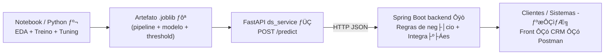

# ChurnInsight ÔÇö Previs├úo de Churn (Hackathon No Country) ­ƒºá­ƒôë


Reposit├│rio `churninsight-nocountry` ÔÇö MVP de **previs├úo de churn** (cancelamento de clientes) desenvolvido para o **Hackathon da No Country**, com foco em neg├│cios de **servi├ºos e assinaturas** (Telecom, Fintech, Streaming, E-commerce).

> **Escopo ponta a ponta (o que funciona hoje)**  
> Notebook treina e compara **3 modelos** ÔåÆ seleciona o melhor (tuned) ÔåÆ **serializa o pipeline em `.joblib`** ÔåÆ **FastAPI** carrega o artefato e exp├Áe `POST /predict` ÔåÆ **Spring Boot** consome a previs├úo para integrar com o ÔÇ£produtoÔÇØ (regras de neg├│cio, CRM, automa├º├Áes). ­ƒÜÇ

---

## ÔÜí Demo em 60 segundos

**Recomendado:** subir tudo com Docker Compose (Spring + FastAPI).

```bash
# Se você usa Git LFS para os .joblib:
git lfs install
git lfs pull

docker compose up --build
```

Acesse:
- FastAPI Swagger: `http://localhost:8000/docs`
- Spring Boot: `http://localhost:8080`

Documentos de apoio:
- Roteiro de banca (apresentação/demonstração): **`docs/DEMO.md`**
- Especificação completa do desafio (texto oficial): **`docs/NOCOUNTRY_SPEC.md`**

> Dica (Windows/PowerShell): `curl` pode ser alias de `Invoke-WebRequest`. Para os exemplos abaixo, prefira `curl.exe`.

---

<a id="menu"></a>
## ­ƒôî Sum├írio

1. [Contexto e objetivo ­ƒÄ»](#sec-01)  
2. [Contexto oficial do Hackathon (NoCountry) ­ƒº¥](#sec-01b)  
3. [Vis├úo geral da solu├º├úo ­ƒº®](#sec-02)  
4. [Arquitetura ­ƒº▒](#sec-03)  
5. [Estrutura do reposit├│rio ­ƒùé´©Å](#sec-04)  
6. [Dataset utilizado ­ƒôª](#sec-05)  
7. [Modelagem, m├®tricas e decis├úo do MVP ­ƒôê](#sec-06)  
8. [Artefatos e serializa├º├úo ­ƒÆ¥](#sec-07)  
9. [Como executar (Docker / Local) ÔÜÖ´©Å](#sec-08)  
10. [Contrato da API (JSON) ­ƒº¥](#sec-09)  
11. [Testes r├ípidos (cURL) ­ƒº¬](#sec-10)  
12. [Endpoints ­ƒöî](#sec-11)  
13. [Troubleshooting ­ƒøá´©Å](#sec-12)  
14. [Pr├│ximos passos ­ƒö¡](#sec-13)  
15. [Time ­ƒæÑ](#sec-14)  

---

<a id="sec-01"></a>
## 1) Contexto e objetivo ­ƒÄ»

Empresas com **receita recorrente** sofrem impacto direto quando clientes cancelam (churn). Reter clientes costuma ser mais barato do que adquirir novos ÔÇö portanto, **antecipar risco** permite a├º├Áes de reten├º├úo mais eficientes.

**Objetivos do projeto:**
- Prever se um cliente **vai cancelar** ou **vai continuar**;
- Retornar tamb├®m uma **probabilidade** (0 a 1) para prioriza├º├úo;
- Disponibilizar a previsão via **API REST**, facilitando consumo por times e sistemas.

[Ô¼å Voltar ao Sum├írio](#menu)

---

<a id="sec-01b"></a>
## 2) Contexto oficial do Hackathon (NoCountry) ­ƒº¥

### Setor de neg├│cio
**Serviços e Assinaturas** (Telecom, Fintech, Streaming, E-commerce)

### Problema
Empresas com clientes recorrentes desejam **reduzir cancelamentos (churn)** e agir **antes** do cliente decidir sair.

### Objetivo do desafio (ChurnInsight)
Construir, em grupo, um **MVP** capaz de:
- **prever churn** (classificação binária: *vai cancelar* / *vai continuar*);
- disponibilizar a previsão via uma **API funcional** para consumo por outros sistemas.

### Exemplo de aplicação (visão de negócio)
Uma fintech quer identificar clientes com alta probabilidade de evasão. Com isso:
- **Marketing** pode oferecer a├º├Áes personalizadas;
- **Suporte/CS** pode agir preventivamente.

### Necessidade do cliente (n├úo t├®cnica)
- Manter clientes ├® mais barato do que conquistar novos.
- O negócio precisa **priorizar retenção** com base em risco:
  - identificar clientes em risco,
  - direcionar ofertas/contatos/b├┤nus,
  - medir impacto ao longo do tempo.

### Entregáveis esperados
- **Notebook (DS)**: EDA, engenharia de features, treino, m├®tricas, serializa├º├úo (`joblib/pickle`)
- **API (Java)**: endpoint de previsão, integração com DS (direta ou via microserviço), logs e erros
- **README**: como rodar, exemplos de request/response, depend├¬ncias/vers├Áes
- **Demo curta**: API em ação + explicação do raciocínio do modelo

### Funcionalidades exigidas (MVP)
- `POST /predict`: recebe JSON e retorna:
  ```json
  { "previsao": "Vai cancelar", "probabilidade": 0.76 }
  ```
- Carregar modelo preditivo (local ou via serviço DS)
- Validar entrada (campos obrigat├│rios)
- Resposta estruturada (previsão + probabilidade)
- **3 exemplos de teste** (com e sem churn)
- Documentação simples para reproduzir

### Funcionalidades opcionais
- `GET /stats`: estatísticas agregadas (ex.: total avaliados, taxa de churn)
- Persistência (H2/PostgreSQL)
- Dashboard (Streamlit/HTML)
- Explicabilidade básica (top 3 variáveis)
- Batch prediction (lista/CSV)
- Docker/Docker Compose
- Testes automatizados (JUnit/pytest)

> Especificação completa (texto oficial): **`docs/NOCOUNTRY_SPEC.md`**

[Ô¼å Voltar ao Sum├írio](#menu)

---

<a id="sec-02"></a>
## 3) Vis├úo geral da solu├º├úo ­ƒº®

A solu├º├úo ├® composta por tr├¬s blocos principais:

### ­ƒº¬ Data Science (Python)
- EDA (análise exploratória), limpeza e preparação de dados;
- Pr├®-processamento com `ColumnTransformer` + `OneHotEncoder`;
- Treino e comparação de **3 algoritmos**:
  - **XGBoost**
  - **Random Forest**
  - **CatBoost** (opcional, se instalado)
- Tuning com **RandomizedSearchCV** e m├®trica **PR-AUC**;
- Calibração de **threshold** no conjunto de validação (*thr_VAL*, não fixo em 0.50);
- Serialização do **pipeline/artefato** em `.joblib`.

### ­ƒÜÇ Servi├ºo do modelo (FastAPI)
- Carrega o artefato serializado (`model/*.joblib`);
- Exp├Áe endpoint principal `POST /predict`;
- Oferece documentação e endpoints de apoio (`/docs`, `/redoc`, `/health`);
- Valida payload com Pydantic e retorna erros de forma controlada (ex.: **HTTP 422**).

### Ôÿò Back-end (Java + Spring Boot)
- Camada de aplicação/produto:
  - Consome a previsão do microserviço (FastAPI) e aplica regras de negócio;
  - Integra com CRM/automação (ex.: abrir ticket, disparar campanha, priorizar atendimento);
  - Governança e evolução: logs, auditoria, autenticação, rate limit etc.

[Ô¼å Voltar ao Sum├írio](#menu)

---

<a id="sec-03"></a>
## 4) Arquitetura ­ƒº▒



**Por que separar assim?**
- **Notebook**: ambiente de experimento e validação (EDA, comparação de modelos, tuning).
- **FastAPI**: infer├¬ncia ÔÇ£production-likeÔÇØ e consistente (carrega artefato e serve previs├Áes).
- **Spring Boot**: camada de produto e integração com o ecossistema do negócio.

[Ô¼å Voltar ao Sum├írio](#menu)

---

<a id="sec-04"></a>
## 5) Estrutura do reposit├│rio ­ƒùé´©Å

Estrutura esperada (pode haver pequenas varia├º├Áes conforme organiza├º├úo do time):

```text
.
Ôö£ÔöÇÔöÇ data/
Ôöé   Ôö£ÔöÇÔöÇ raw/                      # CSV bruto (dataset)
Ôöé   ÔööÔöÇÔöÇ processed/                # (opcional) dados tratados
Ôö£ÔöÇÔöÇ notebooks/
Ôöé   ÔööÔöÇÔöÇ churn_modeling.ipynb      # EDA + treino + tuning + relat├│rio
Ôö£ÔöÇÔöÇ model/
Ôöé   Ôö£ÔöÇÔöÇ churn_xgboost_pipeline.joblib
Ôöé   Ôö£ÔöÇÔöÇ churn_random_forest_pipeline.joblib
Ôöé   Ôö£ÔöÇÔöÇ churn_catboost_pipeline.joblib
    churn_xgboost_pipeline_tuned.joblib   # MVP 
Ôö£ÔöÇÔöÇ ds_service/
Ôöé   Ôö£ÔöÇÔöÇ app.py                    # FastAPI (servi├ºo do modelo)
Ôöé   ÔööÔöÇÔöÇ static/                   # assets (demo)
Ôö£ÔöÇÔöÇ backend/
Ôöé   ÔööÔöÇÔöÇ ...                       # API Java (Spring Boot)
Ôö£ÔöÇÔöÇ docs/
Ôöé   Ôö£ÔöÇÔöÇ DEMO.md                   # roteiro de apresenta├º├úo (banca)
Ôöé   ÔööÔöÇÔöÇ NOCOUNTRY_SPEC.md         # especifica├º├úo oficial do desafio
Ôö£ÔöÇÔöÇ docker-compose.yml            # Execu├º├úo integrada (recomendado)
ÔööÔöÇÔöÇ README.md
```

> Dica (VS Code): use `Ctrl+P` e pesquise `ds_service/app.py` para abrir o serviço rapidamente.

[Ô¼å Voltar ao Sum├írio](#menu)

---

<a id="sec-05"></a>
## 6) Dataset utilizado ­ƒôª

- Dataset: `WA_Fn-UseC_-Telco-Customer-Churn.csv`
- Local esperado: `data/raw/WA_Fn-UseC_-Telco-Customer-Churn.csv`
- Target: `Churn` (`No`/`Yes`)

<details>
  <summary><b>­ƒôÜ Principais features (exemplos)</b></summary>

- Perfil: `gender`, `SeniorCitizen`, `Partner`, `Dependents`  
- Contrato: `Contract`, `tenure`, `PaperlessBilling`, `PaymentMethod`  
- Serviços: `InternetService`, `OnlineSecurity`, `TechSupport`, `StreamingTV`, etc.  
- Valores: `MonthlyCharges`, `TotalCharges`

</details>

[Ô¼å Voltar ao Sum├írio](#menu)

---

<a id="sec-06"></a>
## 7) Modelagem, m├®tricas e decis├úo do MVP ­ƒôê

### Por que treinar 3 modelos? ­ƒñû
Testar algoritmos diferentes reduz o risco de ÔÇ£apostar no escuroÔÇØ e aumenta a robustez da decis├úo:
- Modelos capturam padr├Áes de maneiras distintas;
- Com o **mesmo pr├®-processamento** e o **mesmo protocolo** (split estratificado), a compara├º├úo ├® justa;
- A decis├úo final ├® baseada em **m├®tricas**, n├úo em prefer├¬ncia.

### M├®trica principal: PR-AUC (Average Precision) ­ƒº¡
Em churn, a classe positiva (cancelamento) tende a ser **minoritária**. Por isso, **PR-AUC** costuma ser mais informativa do que acurácia isolada.

### Resultado dos modelos tunados (teste) ­ƒº¬
| Algoritmo | Threshold (VAL) | Accuracy | Precision | Recall | F1 | ROC-AUC | PR-AUC |
|---|---:|---:|---:|---:|---:|---:|---:|
| CatBoost | 0.62 | 0.7828 | 0.5776 | 0.6765 | 0.6232 | 0.8478 | **0.6684** |
| **XGBoost (MVP)** | **0.60** | 0.7793 | 0.5655 | **0.7273** | **0.6363** | 0.8476 | 0.6673 |
| Random Forest | 0.55 | 0.7750 | 0.5600 | 0.7112 | 0.6266 | 0.8442 | 0.6526 |

### Decis├úo do MVP (produ├º├úo/demo): XGBoost (Tuned) ­ƒÅü
Embora o CatBoost tenha PR-AUC **ligeiramente** maior, a diferen├ºa ├® **marginal**. Para churn, priorizamos reduzir **Falsos Negativos** (clientes que cancelam e o modelo n├úo sinaliza). Nesse crit├®rio, o **XGBoost** entregou:
- **Melhor Recall** (captura mais churners);
- **Melhor F1** (equilíbrio entre precision e recall);
- Integração direta e estável com o pipeline serializado e a demo via FastAPI.

> **Por que o threshold n├úo ├® 0.50?**  
> Porque 0.50 ├® arbitr├írio. O threshold ├® calibrado em valida├º├úo para equilibrar erro e capacidade operacional de reten├º├úo (trade-off entre FN e FP).

[Ô¼å Voltar ao Sum├írio](#menu)

---

<a id="sec-07"></a>
## 8) Artefatos e serializa├º├úo ­ƒÆ¥

Ap├│s o treino/tuning, geramos artefatos `.joblib` com:
- Pipeline completo (`preprocess + model`);
- **Threshold calibrado** (`thr_VAL`);
- Features esperadas (contrato de entrada);
- Metadados do tuning (melhores par├ómetros e m├®tricas).

**Artefato principal do MVP:**
- `model/churn_xgboost_pipeline_tuned.joblib` 

> Se os artefatos forem grandes, recomenda-se **Git LFS** para versionamento.

[Ô¼å Voltar ao Sum├írio](#menu)

---

<a id="sec-08"></a>
## 9) Como executar (Docker / Local) ÔÜÖ´©Å

### 9.1 Execu├º├úo recomendada ÔÇö Docker Compose ­ƒÉ│ (Spring + FastAPI)
Pr├®-requisitos:
- Docker Desktop em execução
- Portas livres: `8080` (Spring) e `8000` (FastAPI)

```bash
# Se você usa Git LFS:
git lfs install
git lfs pull

docker compose up --build
```

Acessos:
- FastAPI Swagger: `http://localhost:8000/docs`
- Spring Boot: `http://localhost:8080`

---

### 9.2 Data Science (Notebook) ­ƒº¬
1) Crie e ative um virtualenv:
```bash
python -m venv venv
# Windows (PowerShell)
venv\Scripts\Activate.ps1
# Linux/Mac
# source venv/bin/activate
```

2) Instale dependências:
```bash
pip install -r requirements.txt
```

3) Execute o notebook em `notebooks/` e gere/atualize os artefatos em `model/`.

---

### 9.3 Microservi├ºo do modelo (FastAPI) ­ƒÜÇ
Na raiz do reposit├│rio:
```bash
uvicorn ds_service.app:app --reload --host 0.0.0.0 --port 8000
```

Verifica├º├Áes (navegador):
- Health check: `http://localhost:8000/health`
- Swagger: `http://localhost:8000/docs`
- ReDoc: `http://localhost:8000/redoc`

---

### 9.4 API Java (Spring Boot) Ôÿò
```bash
cd backend
mvn spring-boot:run
```

[Ô¼å Voltar ao Sum├írio](#menu)

---

<a id="sec-09"></a>
## 10) Contrato da API (JSON) ­ƒº¥

### Endpoint principal (FastAPI)
- `POST /predict`
- `Content-Type: application/json`

#### Payload (exemplo válido)
```json
{
  "gender": "Female",
  "SeniorCitizen": 0,
  "Partner": "Yes",
  "Dependents": "No",
  "tenure": 12,
  "PhoneService": "Yes",
  "MultipleLines": "No",
  "InternetService": "Fiber optic",
  "OnlineSecurity": "No",
  "OnlineBackup": "Yes",
  "DeviceProtection": "No",
  "TechSupport": "No",
  "StreamingTV": "Yes",
  "StreamingMovies": "No",
  "Contract": "Month-to-month",
  "PaperlessBilling": "Yes",
  "PaymentMethod": "Electronic check",
  "MonthlyCharges": 70.35,
  "TotalCharges": 151.65
}
```

#### Resposta (exemplo)
```json
{
  "previsao": "Vai cancelar",
  "probabilidade": 0.93
}
```

#### Erros esperados
- **422 (Unprocessable Entity)**: payload inválido (campo faltando / tipo incorreto)
- **500 (Internal Server Error)**: falha interna (modelo ausente, erro de carregamento etc.)

[Ô¼å Voltar ao Sum├írio](#menu)

---

<a id="sec-10"></a>
## 11) Testes r├ípidos (cURL) ­ƒº¬

> Em Windows/PowerShell, use `curl.exe`.

### 11.1 ­ƒøæ Alto risco
```bash
curl.exe -X POST "http://localhost:8000/predict" ^
  -H "Content-Type: application/json" ^
  -d "{\"gender\":\"Female\",\"SeniorCitizen\":0,\"Partner\":\"Yes\",\"Dependents\":\"No\",\"tenure\":1,\"PhoneService\":\"Yes\",\"MultipleLines\":\"No\",\"InternetService\":\"Fiber optic\",\"OnlineSecurity\":\"No\",\"OnlineBackup\":\"Yes\",\"DeviceProtection\":\"No\",\"TechSupport\":\"No\",\"StreamingTV\":\"Yes\",\"StreamingMovies\":\"No\",\"Contract\":\"Month-to-month\",\"PaperlessBilling\":\"Yes\",\"PaymentMethod\":\"Electronic check\",\"MonthlyCharges\":99.0,\"TotalCharges\":99.0}"
```

### 11.2 ­ƒƒó Baixo risco
```bash
curl.exe -X POST "http://localhost:8000/predict" ^
  -H "Content-Type: application/json" ^
  -d "{\"gender\":\"Male\",\"SeniorCitizen\":0,\"Partner\":\"Yes\",\"Dependents\":\"Yes\",\"tenure\":60,\"PhoneService\":\"Yes\",\"MultipleLines\":\"Yes\",\"InternetService\":\"DSL\",\"OnlineSecurity\":\"Yes\",\"OnlineBackup\":\"Yes\",\"DeviceProtection\":\"Yes\",\"TechSupport\":\"Yes\",\"StreamingTV\":\"No\",\"StreamingMovies\":\"No\",\"Contract\":\"Two year\",\"PaperlessBilling\":\"No\",\"PaymentMethod\":\"Credit card (automatic)\",\"MonthlyCharges\":29.0,\"TotalCharges\":1700.0}"
```

### 11.3 ÔÜá´©Å Inv├ílido (gera 422)
```bash
curl.exe -X POST "http://localhost:8000/predict" ^
  -H "Content-Type: application/json" ^
  -d "{\"gender\":\"Female\",\"SeniorCitizen\":0,\"Partner\":\"Yes\",\"Dependents\":\"No\",\"tenure\":\"doze\",\"PhoneService\":\"Yes\",\"MultipleLines\":\"No\",\"InternetService\":\"Fiber optic\",\"OnlineSecurity\":\"No\",\"OnlineBackup\":\"Yes\",\"DeviceProtection\":\"No\",\"TechSupport\":\"No\",\"StreamingTV\":\"Yes\",\"StreamingMovies\":\"No\",\"Contract\":\"Month-to-month\",\"PaperlessBilling\":\"Yes\",\"PaymentMethod\":\"Electronic check\",\"MonthlyCharges\":70.35,\"TotalCharges\":151.65}"
```

[Ô¼å Voltar ao Sum├írio](#menu)

---

<a id="sec-11"></a>
## 12) Endpoints ­ƒöî

### FastAPI (ds_service)
- `POST /predict` ÔÇö previs├úo e probabilidade
- `GET /health` ÔÇö healthcheck
- `GET /docs` ÔÇö Swagger
- `GET /redoc` ÔÇö ReDoc

### Spring Boot (backend)
- Endpoints do produto/camada de integração (variável conforme implementação do time)

[Ô¼å Voltar ao Sum├írio](#menu)

---

<a id="sec-12"></a>
## 13) Troubleshooting ­ƒøá´©Å

**1) Modelo não encontrado / erro ao carregar `.joblib`**
- Confirme a existência de `model/churn_xgboost_pipeline_tuned.joblib`
- Se usa Git LFS: `git lfs pull`
- Em Docker: confirme que o arquivo foi copiado/está acessível no container

**2) FastAPI retorna 422**
- Campo faltando ou tipo incorreto (ex.: n├║mero enviado como string)
- Compare seu payload com o exemplo de contrato em [Contrato da API](#sec-09)

**3) Spring não conecta no FastAPI**
- Local: `http://localhost:8000`
- Docker Compose: use o nome do serviço (ex.: `http://ds-service:8000`) no `DS_SERVICE_URL`

[Ô¼å Voltar ao Sum├írio](#menu)

---

<a id="sec-13"></a>
## 14) Pr├│ximos passos ­ƒö¡

- ­ƒöÉ Autentica├º├úo/autoriza├º├úo no Spring Boot (camada de produto)
- ­ƒôè Observabilidade: logs estruturados, m├®tricas de lat├¬ncia e taxa de erro
- ­ƒº¬ Calibra├º├úo por custo (FN vs FP) e capacidade operacional do time de reten├º├úo
- ­ƒºá Explicabilidade (ex.: SHAP) para justificar previs├Áes
- Ôÿü´©Å Deploy (Docker + cloud) para demo p├║blica (considerando limites do Free Tier)

[Ô¼å Voltar ao Sum├írio](#menu)

---

<a id="sec-14"></a>
## 15) Time ­ƒæÑ

- Hackathon No Country ÔÇö equipe ChurnInsight

> Atualize esta seção com os nomes/links do time conforme o padrão do repositório.

[Ô¼å Voltar ao Sum├írio](#menu)
