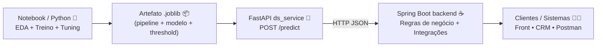

# ChurnInsight — Previsão de Churn (Hackathon No Country) 🧠📉


Repositório `churninsight-nocountry` — MVP de **previsão de churn** (cancelamento de clientes) desenvolvido para o **Hackathon da No Country**, com foco em negócios de **serviços e assinaturas** (Telecom, Fintech, Streaming, E-commerce).

> **Escopo ponta a ponta (o que funciona hoje)**  
> Notebook treina e compara **3 modelos** → seleciona o melhor (tuned) → **serializa o pipeline em `.joblib`** → **FastAPI** carrega o artefato e expõe `POST /predict` → **Spring Boot** consome a previsão para integrar com o “produto” (regras de negócio, CRM, automações). 🚀

---

## ⚡ Demo em 60 segundos

**Recomendado:** subir tudo com Docker Compose (Spring + FastAPI).

```bash
# Se você usa Git LFS para os .joblib:
git lfs install
git lfs pull

docker compose up --build
```

Acesse:
- FastAPI Swagger: `http://localhost:8000/docs`
- Spring Boot: `http://localhost:8080`

Documentos de apoio:
- Roteiro de banca (apresentação/demonstração): **`docs/DEMO.md`**
- Especificação completa do desafio (texto oficial): **`docs/NOCOUNTRY_SPEC.md`**

> Dica (Windows/PowerShell): `curl` pode ser alias de `Invoke-WebRequest`. Para os exemplos abaixo, prefira `curl.exe`.

---

<a id="menu"></a>
## 📌 Sumário

1. [Contexto e objetivo 🎯](#sec-01)  
2. [Contexto oficial do Hackathon (NoCountry) 🧾](#sec-01b)  
3. [Visão geral da solução 🧩](#sec-02)  
4. [Arquitetura 🧱](#sec-03)  
5. [Estrutura do repositório 🗂️](#sec-04)  
6. [Dataset utilizado 📦](#sec-05)  
7. [Modelagem, métricas e decisão do MVP 📈](#sec-06)  
8. [Artefatos e serialização 💾](#sec-07)  
9. [Como executar (Docker / Local) ⚙️](#sec-08)  
10. [Contrato da API (JSON) 🧾](#sec-09)  
11. [Testes rápidos (cURL) 🧪](#sec-10)  
12. [Endpoints 🔌](#sec-11)  
13. [Troubleshooting 🛠️](#sec-12)  
14. [Próximos passos 🔭](#sec-13)  
15. [Time 👥](#sec-14)  

---

<a id="sec-01"></a>
## 1) Contexto e objetivo 🎯

Empresas com **receita recorrente** sofrem impacto direto quando clientes cancelam (churn). Reter clientes costuma ser mais barato do que adquirir novos — portanto, **antecipar risco** permite ações de retenção mais eficientes.

**Objetivos do projeto:**
- Prever se um cliente **vai cancelar** ou **vai continuar**;
- Retornar também uma **probabilidade** (0 a 1) para priorização;
- Disponibilizar a previsão via **API REST**, facilitando consumo por times e sistemas.

[⬆ Voltar ao Sumário](#menu)

---

<a id="sec-01b"></a>
## 2) Contexto oficial do Hackathon (NoCountry) 🧾

### Setor de negócio
**Serviços e Assinaturas** (Telecom, Fintech, Streaming, E-commerce)

### Problema
Empresas com clientes recorrentes desejam **reduzir cancelamentos (churn)** e agir **antes** do cliente decidir sair.

### Objetivo do desafio (ChurnInsight)
Construir, em grupo, um **MVP** capaz de:
- **prever churn** (classificação binária: *vai cancelar* / *vai continuar*);
- disponibilizar a previsão via uma **API funcional** para consumo por outros sistemas.

### Exemplo de aplicação (visão de negócio)
Uma fintech quer identificar clientes com alta probabilidade de evasão. Com isso:
- **Marketing** pode oferecer ações personalizadas;
- **Suporte/CS** pode agir preventivamente.

### Necessidade do cliente (não técnica)
- Manter clientes é mais barato do que conquistar novos.
- O negócio precisa **priorizar retenção** com base em risco:
  - identificar clientes em risco,
  - direcionar ofertas/contatos/bônus,
  - medir impacto ao longo do tempo.

### Entregáveis esperados
- **Notebook (DS)**: EDA, engenharia de features, treino, métricas, serialização (`joblib/pickle`)
- **API (Java)**: endpoint de previsão, integração com DS (direta ou via microserviço), logs e erros
- **README**: como rodar, exemplos de request/response, dependências/versões
- **Demo curta**: API em ação + explicação do raciocínio do modelo

### Funcionalidades exigidas (MVP)
- `POST /predict`: recebe JSON e retorna:
  ```json
  { "previsao": "Vai cancelar", "probabilidade": 0.76 }
  ```
- Carregar modelo preditivo (local ou via serviço DS)
- Validar entrada (campos obrigatórios)
- Resposta estruturada (previsão + probabilidade)
- **3 exemplos de teste** (com e sem churn)
- Documentação simples para reproduzir

### Funcionalidades opcionais
- `GET /stats`: estatísticas agregadas (ex.: total avaliados, taxa de churn)
- Persistência (H2/PostgreSQL)
- Dashboard (Streamlit/HTML)
- Explicabilidade básica (top 3 variáveis)
- Batch prediction (lista/CSV)
- Docker/Docker Compose
- Testes automatizados (JUnit/pytest)

> Especificação completa (texto oficial): **`docs/NOCOUNTRY_SPEC.md`**

[⬆ Voltar ao Sumário](#menu)

---

<a id="sec-02"></a>
## 3) Visão geral da solução 🧩

A solução é composta por três blocos principais:

### 🧪 Data Science (Python)
- EDA (análise exploratória), limpeza e preparação de dados;
- Pré-processamento com `ColumnTransformer` + `OneHotEncoder`;
- Treino e comparação de **3 algoritmos**:
  - **XGBoost**
  - **Random Forest**
  - **CatBoost** (opcional, se instalado)
- Tuning com **RandomizedSearchCV** e métrica **PR-AUC**;
- Calibração de **threshold** no conjunto de validação (*thr_VAL*, não fixo em 0.50);
- Serialização do **pipeline/artefato** em `.joblib`.

### 🚀 Serviço do modelo (FastAPI)
- Carrega o artefato serializado (`model/*.joblib`);
- Expõe endpoint principal `POST /predict`;
- Oferece documentação e endpoints de apoio (`/docs`, `/redoc`, `/health`);
- Valida payload com Pydantic e retorna erros de forma controlada (ex.: **HTTP 422**).

### ☕ Back-end (Java + Spring Boot)
- Camada de aplicação/produto:
  - Consome a previsão do microserviço (FastAPI) e aplica regras de negócio;
  - Integra com CRM/automação (ex.: abrir ticket, disparar campanha, priorizar atendimento);
  - Governança e evolução: logs, auditoria, autenticação, rate limit etc.

[⬆ Voltar ao Sumário](#menu)

---

<a id="sec-03"></a>
## 4) Arquitetura 🧱



**Por que separar assim?**
- **Notebook**: ambiente de experimento e validação (EDA, comparação de modelos, tuning).
- **FastAPI**: inferência “production-like” e consistente (carrega artefato e serve previsões).
- **Spring Boot**: camada de produto e integração com o ecossistema do negócio.

[⬆ Voltar ao Sumário](#menu)

---

<a id="sec-04"></a>
## 5) Estrutura do repositório 🗂️

Estrutura esperada (pode haver pequenas variações conforme organização do time):

```text
.
├── data/
│   ├── raw/                      # CSV bruto (dataset)
│   └── processed/                # (opcional) dados tratados
├── notebooks/
│   └── churn_modeling.ipynb      # EDA + treino + tuning + relatório
├── model/
│   ├── churn_xgboost_pipeline.joblib
│   ├── churn_random_forest_pipeline.joblib
│   ├── churn_catboost_pipeline.joblib
│   └── churn_xgboost_pipeline_tuned.joblib   # MVP ✅
├── ds_service/
│   ├── app.py                    # FastAPI (serviço do modelo)
│   └── static/                   # assets (demo)
├── backend/
│   └── ...                       # API Java (Spring Boot)
├── docs/
│   ├── DEMO.md                   # roteiro de apresentação (banca)
│   └── NOCOUNTRY_SPEC.md         # especificação oficial do desafio
├── docker-compose.yml            # Execução integrada (recomendado)
└── README.md
```

> Dica (VS Code): use `Ctrl+P` e pesquise `ds_service/app.py` para abrir o serviço rapidamente.

[⬆ Voltar ao Sumário](#menu)

---

<a id="sec-05"></a>
## 6) Dataset utilizado 📦

- Dataset: `WA_Fn-UseC_-Telco-Customer-Churn.csv`
- Local esperado: `data/raw/WA_Fn-UseC_-Telco-Customer-Churn.csv`
- Target: `Churn` (`No`/`Yes`)

<details>
  <summary><b>📚 Principais features (exemplos)</b></summary>

- Perfil: `gender`, `SeniorCitizen`, `Partner`, `Dependents`  
- Contrato: `Contract`, `tenure`, `PaperlessBilling`, `PaymentMethod`  
- Serviços: `InternetService`, `OnlineSecurity`, `TechSupport`, `StreamingTV`, etc.  
- Valores: `MonthlyCharges`, `TotalCharges`

</details>

[⬆ Voltar ao Sumário](#menu)

---

<a id="sec-06"></a>
## 7) Modelagem, métricas e decisão do MVP 📈

### Por que treinar 3 modelos? 🤖
Testar algoritmos diferentes reduz o risco de “apostar no escuro” e aumenta a robustez da decisão:
- Modelos capturam padrões de maneiras distintas;
- Com o **mesmo pré-processamento** e o **mesmo protocolo** (split estratificado), a comparação é justa;
- A decisão final é baseada em **métricas**, não em preferência.

### Métrica principal: PR-AUC (Average Precision) 🧭
Em churn, a classe positiva (cancelamento) tende a ser **minoritária**. Por isso, **PR-AUC** costuma ser mais informativa do que acurácia isolada.

### Resultado dos modelos tunados (teste) 🧪
| Algoritmo | Threshold (VAL) | Accuracy | Precision | Recall | F1 | ROC-AUC | PR-AUC |
|---|---:|---:|---:|---:|---:|---:|---:|
| CatBoost | 0.62 | 0.7828 | 0.5776 | 0.6765 | 0.6232 | 0.8478 | **0.6684** |
| **XGBoost (MVP)** | **0.60** | 0.7793 | 0.5655 | **0.7273** | **0.6363** | 0.8476 | 0.6673 |
| Random Forest | 0.55 | 0.7750 | 0.5600 | 0.7112 | 0.6266 | 0.8442 | 0.6526 |

### Decisão do MVP (produção/demo): XGBoost (Tuned) 🏁
Embora o CatBoost tenha PR-AUC **ligeiramente** maior, a diferença é **marginal**. Para churn, priorizamos reduzir **Falsos Negativos** (clientes que cancelam e o modelo não sinaliza). Nesse critério, o **XGBoost** entregou:
- **Melhor Recall** (captura mais churners);
- **Melhor F1** (equilíbrio entre precision e recall);
- Integração direta e estável com o pipeline serializado e a demo via FastAPI.

> **Por que o threshold não é 0.50?**  
> Porque 0.50 é arbitrário. O threshold é calibrado em validação para equilibrar erro e capacidade operacional de retenção (trade-off entre FN e FP).

[⬆ Voltar ao Sumário](#menu)

---

<a id="sec-07"></a>
## 8) Artefatos e serialização 💾

Após o treino/tuning, geramos artefatos `.joblib` com:
- Pipeline completo (`preprocess + model`);
- **Threshold calibrado** (`thr_VAL`);
- Features esperadas (contrato de entrada);
- Metadados do tuning (melhores parâmetros e métricas).

**Artefato principal do MVP:**
- `model/churn_xgboost_pipeline_tuned.joblib` ✅

> Se os artefatos forem grandes, recomenda-se **Git LFS** para versionamento.

[⬆ Voltar ao Sumário](#menu)

---

<a id="sec-08"></a>
## 9) Como executar (Docker / Local) ⚙️

### 9.1 Execução recomendada — Docker Compose 🐳 (Spring + FastAPI)
Pré-requisitos:
- Docker Desktop em execução
- Portas livres: `8080` (Spring) e `8000` (FastAPI)

```bash
# Se você usa Git LFS:
git lfs install
git lfs pull

docker compose up --build
```

Acessos:
- FastAPI Swagger: `http://localhost:8000/docs`
- Spring Boot: `http://localhost:8080`

---

### 9.2 Data Science (Notebook) 🧪
1) Crie e ative um virtualenv:
```bash
python -m venv venv
# Windows (PowerShell)
venv\Scripts\Activate.ps1
# Linux/Mac
# source venv/bin/activate
```

2) Instale dependências:
```bash
pip install -r requirements.txt
```

3) Execute o notebook em `notebooks/` e gere/atualize os artefatos em `model/`.

---

### 9.3 Microserviço do modelo (FastAPI) 🚀
Na raiz do repositório:
```bash
uvicorn ds_service.app:app --reload --host 0.0.0.0 --port 8000
```

Verificações (navegador):
- Health check: `http://localhost:8000/health`
- Swagger: `http://localhost:8000/docs`
- ReDoc: `http://localhost:8000/redoc`

---

### 9.4 API Java (Spring Boot) ☕
```bash
cd backend
mvn spring-boot:run
```

[⬆ Voltar ao Sumário](#menu)

---

<a id="sec-09"></a>
## 10) Contrato da API (JSON) 🧾

### Endpoint principal (FastAPI)
- `POST /predict`
- `Content-Type: application/json`

#### Payload (exemplo válido)
```json
{
  "gender": "Female",
  "SeniorCitizen": 0,
  "Partner": "Yes",
  "Dependents": "No",
  "tenure": 12,
  "PhoneService": "Yes",
  "MultipleLines": "No",
  "InternetService": "Fiber optic",
  "OnlineSecurity": "No",
  "OnlineBackup": "Yes",
  "DeviceProtection": "No",
  "TechSupport": "No",
  "StreamingTV": "Yes",
  "StreamingMovies": "No",
  "Contract": "Month-to-month",
  "PaperlessBilling": "Yes",
  "PaymentMethod": "Electronic check",
  "MonthlyCharges": 70.35,
  "TotalCharges": 151.65
}
```

#### Resposta (exemplo)
```json
{
  "previsao": "Vai cancelar",
  "probabilidade": 0.93
}
```

#### Erros esperados
- **422 (Unprocessable Entity)**: payload inválido (campo faltando / tipo incorreto)
- **500 (Internal Server Error)**: falha interna (modelo ausente, erro de carregamento etc.)

[⬆ Voltar ao Sumário](#menu)

---

<a id="sec-10"></a>
## 11) Testes rápidos (cURL) 🧪

> Em Windows/PowerShell, use `curl.exe`.

### 11.1 🛑 Alto risco
```bash
curl.exe -X POST "http://localhost:8000/predict" ^
  -H "Content-Type: application/json" ^
  -d "{\"gender\":\"Female\",\"SeniorCitizen\":0,\"Partner\":\"Yes\",\"Dependents\":\"No\",\"tenure\":1,\"PhoneService\":\"Yes\",\"MultipleLines\":\"No\",\"InternetService\":\"Fiber optic\",\"OnlineSecurity\":\"No\",\"OnlineBackup\":\"Yes\",\"DeviceProtection\":\"No\",\"TechSupport\":\"No\",\"StreamingTV\":\"Yes\",\"StreamingMovies\":\"No\",\"Contract\":\"Month-to-month\",\"PaperlessBilling\":\"Yes\",\"PaymentMethod\":\"Electronic check\",\"MonthlyCharges\":99.0,\"TotalCharges\":99.0}"
```

### 11.2 🟢 Baixo risco
```bash
curl.exe -X POST "http://localhost:8000/predict" ^
  -H "Content-Type: application/json" ^
  -d "{\"gender\":\"Male\",\"SeniorCitizen\":0,\"Partner\":\"Yes\",\"Dependents\":\"Yes\",\"tenure\":60,\"PhoneService\":\"Yes\",\"MultipleLines\":\"Yes\",\"InternetService\":\"DSL\",\"OnlineSecurity\":\"Yes\",\"OnlineBackup\":\"Yes\",\"DeviceProtection\":\"Yes\",\"TechSupport\":\"Yes\",\"StreamingTV\":\"No\",\"StreamingMovies\":\"No\",\"Contract\":\"Two year\",\"PaperlessBilling\":\"No\",\"PaymentMethod\":\"Credit card (automatic)\",\"MonthlyCharges\":29.0,\"TotalCharges\":1700.0}"
```

### 11.3 ⚠️ Inválido (gera 422)
```bash
curl.exe -X POST "http://localhost:8000/predict" ^
  -H "Content-Type: application/json" ^
  -d "{\"gender\":\"Female\",\"SeniorCitizen\":0,\"Partner\":\"Yes\",\"Dependents\":\"No\",\"tenure\":\"doze\",\"PhoneService\":\"Yes\",\"MultipleLines\":\"No\",\"InternetService\":\"Fiber optic\",\"OnlineSecurity\":\"No\",\"OnlineBackup\":\"Yes\",\"DeviceProtection\":\"No\",\"TechSupport\":\"No\",\"StreamingTV\":\"Yes\",\"StreamingMovies\":\"No\",\"Contract\":\"Month-to-month\",\"PaperlessBilling\":\"Yes\",\"PaymentMethod\":\"Electronic check\",\"MonthlyCharges\":70.35,\"TotalCharges\":151.65}"
```

[⬆ Voltar ao Sumário](#menu)

---

<a id="sec-11"></a>
## 12) Endpoints 🔌

### FastAPI (ds_service)
- `POST /predict` — previsão e probabilidade
- `GET /health` — healthcheck
- `GET /docs` — Swagger
- `GET /redoc` — ReDoc

### Spring Boot (backend)
- Endpoints do produto/camada de integração (variável conforme implementação do time)

[⬆ Voltar ao Sumário](#menu)

---

<a id="sec-12"></a>
## 13) Troubleshooting 🛠️

**1) Modelo não encontrado / erro ao carregar `.joblib`**
- Confirme a existência de `model/churn_xgboost_pipeline_tuned.joblib`
- Se usa Git LFS: `git lfs pull`
- Em Docker: confirme que o arquivo foi copiado/está acessível no container

**2) FastAPI retorna 422**
- Campo faltando ou tipo incorreto (ex.: número enviado como string)
- Compare seu payload com o exemplo de contrato em [Contrato da API](#sec-09)

**3) Spring não conecta no FastAPI**
- Local: `http://localhost:8000`
- Docker Compose: use o nome do serviço (ex.: `http://ds-service:8000`) no `DS_SERVICE_URL`

[⬆ Voltar ao Sumário](#menu)

---

<a id="sec-13"></a>
## 14) Próximos passos 🔭

- 🔐 Autenticação/autorização no Spring Boot (camada de produto)
- 📊 Observabilidade: logs estruturados, métricas de latência e taxa de erro
- 🧪 Calibração por custo (FN vs FP) e capacidade operacional do time de retenção
- 🧠 Explicabilidade (ex.: SHAP) para justificar previsões
- ☁️ Deploy (Docker + cloud) para demo pública (considerando limites do Free Tier)

[⬆ Voltar ao Sumário](#menu)

---

<a id="sec-14"></a>
## 15) Time 👥

- Hackathon No Country - Data Science

- ## 👥 Equipe

**Nome**: ChurnGuard Analytics 


| Foto                                                                                                                      | Nome                      | Squad              | LinkedIn                                                           | GitHub |
|---------------------------------------------------------------------------------------------------------------------------|---------------------------|-------------------|--------------------------------------------------------------------|--------|
|      | **Luiz André de Souza**        | Data Science | [LinkedIn](https://www.linkedin.com/in/)            | [GitHub](https://github.com/brodyandre) |                          | [GitHub](https://github.com/PHmore) |
|           | **Pedro Cassio** | Data Science | [LinkedIn](https://www.linkedin.com/in/pedro-cassio/)                          | [GitHub]


[⬆ Voltar ao Sumário](#menu)
